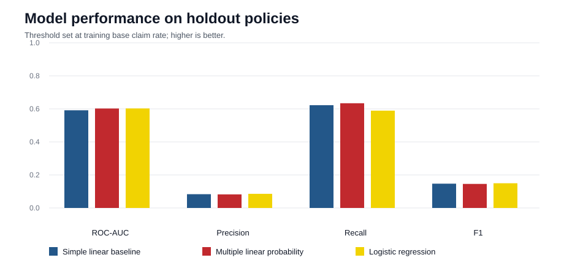
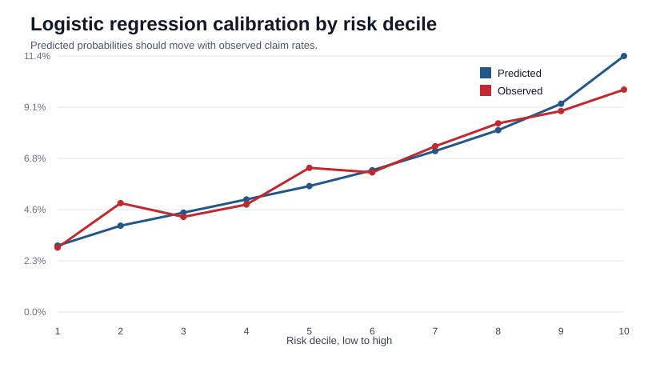

# Auto Insurance Claim Probability Modeling

This repository analyzes policy-level auto insurance claim occurrence using statistical regression models. The response variable is a binary claim indicator, and the project evaluates how well different model specifications separate higher-risk policies from lower-risk policies.

The workflow starts with a one-variable simple linear regression baseline, extends the model into a multivariate linear probability model, and then compares the linear results with logistic regression. This creates a clear modeling progression from an interpretable statistical baseline to a probability model that is more suitable for a binary insurance outcome.

## Objectives

- Build a reproducible claim occurrence modeling workflow from raw policy-level data.
- Use simple linear regression as a transparent baseline for a binary claim indicator.
- Compare linear probability modeling with logistic regression.
- Evaluate performance using ranking, calibration, and lift metrics rather than accuracy alone.
- Document the model's limitations in an actuarial context.

## Dataset

The analysis uses a Kaggle auto insurance claims dataset with policy, customer, regional, and vehicle attributes. The target variable is:

```text
claim_status = 1 if a claim occurred
claim_status = 0 otherwise
```

Local dataset summary:

| Item | Value |
|---|---:|
| Policies | 58,592 |
| Features | 40 predictors + target |
| Claims | 3,748 |
| Claim rate | 6.40% |

The raw CSV is not committed to this repository. To reproduce the analysis, place the file at:

```text
data/raw/Insurance claims data.csv
```

or set:

```bash
INSURANCE_CLAIMS_CSV="/path/to/Insurance claims data.csv"
```

## Methodological Framework

The project compares three models on a stratified train/test split.

| Component | Method | Purpose |
|---|---|---|
| Baseline | Simple linear regression | Uses `subscription_length` as a one-variable benchmark. |
| Linear probability model | Multiple linear regression | Adds customer, vehicle, and regional predictors while keeping a linear structure. |
| Binary response model | Logistic regression | Uses the same predictors with a binomial link, producing probabilities constrained to `[0, 1]`. |

The first two models are intentionally linear. They make the regression setup transparent and provide a benchmark before switching to logistic regression.

## Evaluation Metrics

The dataset is imbalanced because most policies do not have claims. Because of that, accuracy alone is not very informative. The project reports:

- **ROC-AUC** for ranking performance;
- **Brier score** for probability forecast error;
- **precision and recall** at the portfolio base-rate threshold;
- **top-decile lift** to measure claim concentration in the highest predicted-risk group.

## Results

Python implementation:

| Model | ROC-AUC | Precision | Recall | Brier Score | Top-Decile Lift |
|---|---:|---:|---:|---:|---:|
| Simple linear baseline | 0.592 | 0.083 | 0.622 | 0.0595 | 1.27x |
| Multiple linear probability | 0.602 | 0.082 | 0.634 | 0.0595 | 1.54x |
| Logistic regression | 0.603 | 0.086 | 0.589 | 0.0595 | 1.55x |

R implementation:

| Model | ROC-AUC | Precision | Recall | Brier Score | Top-Decile Lift |
|---|---:|---:|---:|---:|---:|
| Simple linear baseline | 0.592 | 0.082 | 0.601 | 0.0595 | 1.42x |
| Multiple linear probability | 0.606 | 0.082 | 0.639 | 0.0594 | 1.63x |
| Logistic regression | 0.606 | 0.085 | 0.587 | 0.0594 | 1.68x |

The logistic regression model provides the strongest risk segmentation in the R workflow, with a top-decile lift of about 1.68x. This means the highest predicted-risk decile has a materially higher observed claim rate than the overall test portfolio.





## Report

The LaTeX report provides a concise technical write-up of the dataset, model design, validation metrics, holdout results, calibration pattern, and modeling limitations:

- `docs/Auto_Insurance_Claim_Probability_Model_Report.tex`
- `docs/Auto_Insurance_Claim_Probability_Model_Report.pdf`

## Repository Structure

```text
.
|-- R/
|   `-- claim_probability_models.R
|-- src/
|   `-- claim_probability_models.py
|-- docs/
|   |-- Auto_Insurance_Claim_Probability_Model_Report.pdf
|   |-- Auto_Insurance_Claim_Probability_Model_Report.tex
|   `-- model_walkthrough.md
|-- figures/
|   |-- model_performance.svg
|   |-- r_model_performance.svg
|   `-- logistic_calibration.svg
|-- outputs/
|   |-- data_summary.csv
|   |-- model_metrics.csv
|   |-- r_data_summary.csv
|   `-- r_model_metrics.csv
`-- data/
    `-- README.md
```

## Tools

| Area | Tools |
|---|---|
| Data handling | R, Python, pandas, dplyr-style workflow |
| Statistical modeling | `lm()`, `glm(..., family = binomial)`, scikit-learn |
| Evaluation | ROC-AUC, Brier score, precision, recall, top-decile lift |
| Reporting | LaTeX, generated CSV outputs, SVG figures |

## Reproducibility

Run the R version:

```bash
Rscript R/claim_probability_models.R
```

Run the Python version:

```bash
python -m pip install -r requirements.txt
python src/claim_probability_models.py
```

Build the report from LaTeX:

```bash
latexmk -pdf docs/Auto_Insurance_Claim_Probability_Model_Report.tex
```

## Modeling Notes

Linear regression is used here as a transparent statistical baseline for a binary claim indicator. The comparison with logistic regression highlights a common modeling issue: a linear probability model can be interpretable, but it may produce invalid probability estimates outside the `[0, 1]` range. Logistic regression is more appropriate when the response variable is binary.

The available variables provide moderate segmentation power rather than a highly predictive model. Stronger insurance modeling would typically require exposure information, coverage details, prior claims, loss amounts, and richer territorial or behavioral variables.
